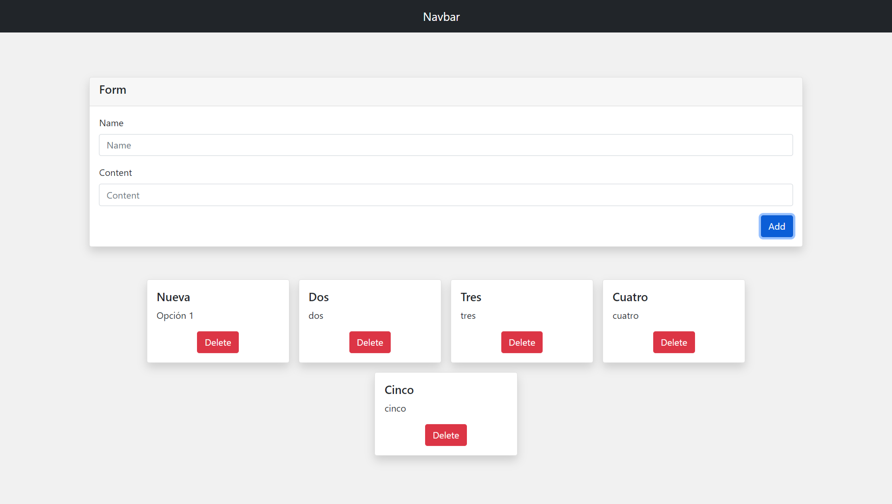

# react-basics

App developed with react 

## Requirements

- Node JS
- Yarn

## Installation

First download or clone the repository. Next to place inside the folder. and run the next command to install the dependencies

```bash
yarn 
```

## Run

In order to run the project run the next command

```bash
yarn start
```

## Views
Home

